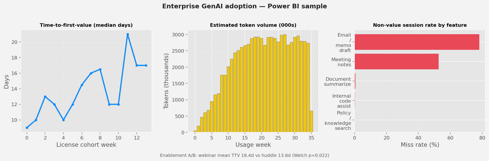

# Enterprise GenAI adoption analytics (synthetic)



| Metric | Webinar enablement | Huddle enablement |
|--------|-------------------:|------------------:|
| Mean time-to-first-value | 16.4 days | 13.6 days |
| Users reaching value within 14 days | 49.0% | 64.4% |
| Welch t-test (TTV) | — | p = 0.022 |
| Draft feature non-value rate | 78.1% | — |
| Policy search non-value rate | 0.2% | — |

**Personal project — Ishan Moudgil, 2026**

Product-analytics sample for **enterprise GenAI enablement**: adoption dashboards, weekly “so what?” readouts, qualitative user-research themes, and a measurement playbook.

**All data is synthetic.** Not based on any employer or production system.

## Why it exists

GenAI programs often report **seats and sessions**. This project models three gaps that matter for enablement teams:

1. Licensed ≠ activated (rollout quality).
2. High-volume features can be toys (**draft** vs **search**).
3. Consumer ChatGPT/Claude/Gemini set expectations; internal tools need grounded metrics.

Planted, checkable findings (seed 42):

- Lagging **activation** in later rollout waves.
- **Draft** with a lower value-event rate than search / code assist.
- Higher copy-to-external (shadow IT proxy) where enablement was webinar-only.
- Public **agent** trend index rising faster than enterprise **prompt** index.

## Stack

Python, pandas, **SQL** (SQLite warehouse), **Power BI** (CSV import pack), Excel, matplotlib, Plotly.

```
rbc-genai-adoption-analytics/
├── src/                 pipeline: generate → SQL → readout → dashboard → Power BI exports
├── docs/                playbook, sample readout, experiment memo, dashboard screenshot
├── outputs/powerbi/     CSVs for Power BI Desktop import
└── outputs/             dashboard HTML, CSV summaries, Excel pack
```

## Quick start

```bash
cd rbc-genai-adoption-analytics
python3 -m venv .venv && source .venv/bin/activate
pip install -r requirements.txt
python src/run_all.py
open outputs/adoption_dashboard.html
```

**Power BI Desktop:** Import everything under `outputs/powerbi/` (weekly usage, token estimates, TTV by cohort, enablement A/B summary). Rebuild the preview PNG with `python src/build_powerbi_dashboard.py`.

## Documentation

- [`docs/measurement-playbook.md`](docs/measurement-playbook.md) — metric definitions and weekly cadence
- [`docs/weekly-readout.md`](docs/weekly-readout.md) — sample readout for product / enablement stakeholders
- [`docs/enablement-experiment-memo.md`](docs/enablement-experiment-memo.md) — webinar vs huddle A/B on time-to-first-value

Regenerate `data/` and full outputs with `python src/run_all.py` after clone.
